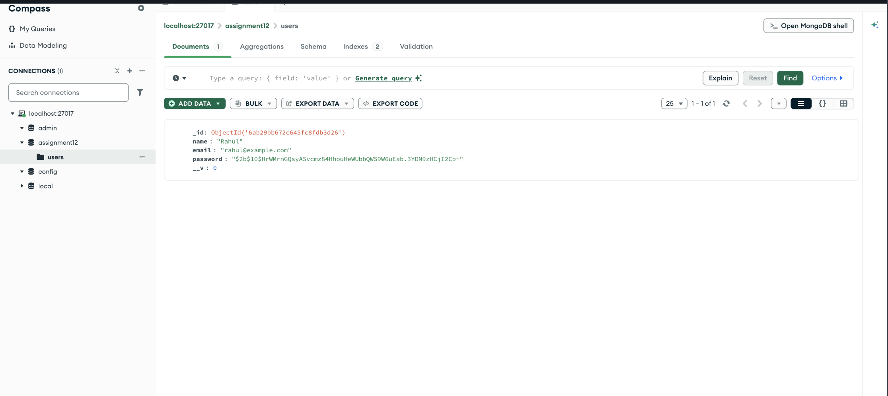
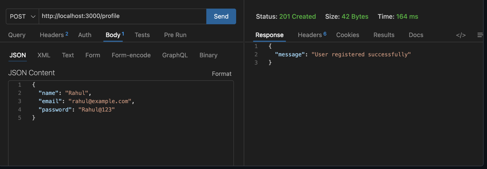
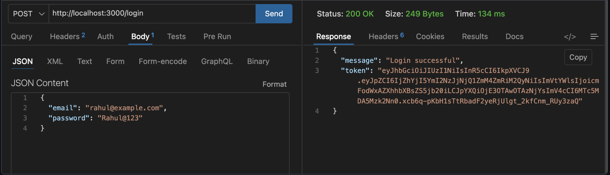
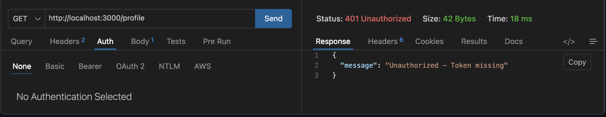
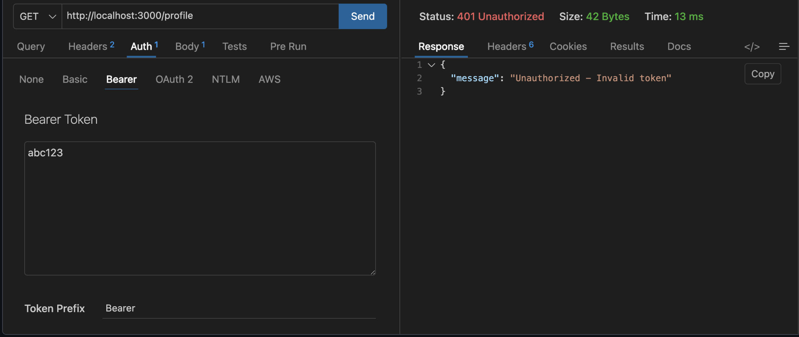
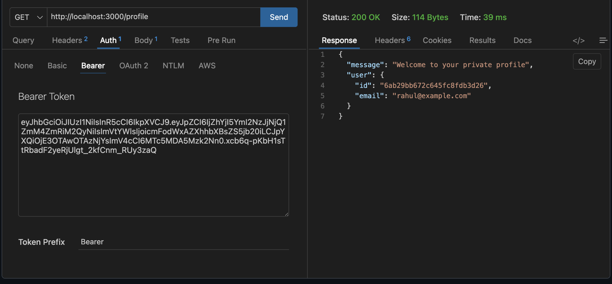

# User Registration, Login and JWT Authentication

**Assignment 12**  
**Student:** Jaspreet Kaur Bassi  
**Roll No.:** 150096725014  
**Subject:** Backend Development

This project is a secure authentication API built with Node.js and Express.js. It supports user registration, bcrypt password hashing, login, JWT generation, and a protected profile endpoint.

## Features

- Register a new user with name, email, and password
- Prevent duplicate email registration
- Hash passwords with `bcrypt` before storage
- Authenticate users with `bcrypt.compare()`
- Generate one-hour JSON Web Tokens after login
- Protect `GET /profile` with Bearer-token middleware
- Store users in MongoDB Atlas through Mongoose
- Run locally in demo mode when `MONGO_URI` is not configured

## Technologies

- Node.js
- Express.js
- MongoDB Atlas
- Mongoose
- bcrypt
- jsonwebtoken
- dotenv
- Postman or the included browser test console

## Project Structure

```text
render/
├── server.js          # Express API, schema, routes, and auth middleware
├── data.json          # Local demo-mode data store
├── package.json
├── .env.example       # Safe environment-variable template
├── .gitignore
└── screenshots/       # Authentication test evidence
```

## Installation

Open a terminal in the `render` folder and run:

```bash
npm install
```

Create a `.env` file from `.env.example`:

```env
MONGO_URI=mongodb+srv://<username>:<password>@<cluster>/<database>
JWT_SECRET=replace_with_a_long_random_secret
PORT=3000
```

Never commit the real `.env` file. It is excluded by `.gitignore`.

## Run the Server

```bash
npm start
```

The API is available at:

```text
http://localhost:3000
```

With a valid `MONGO_URI`, users are stored in MongoDB Atlas. Without it, the project uses `data.json` for local demonstration and testing only.

The included live test console is available at:

```text
http://localhost:3000/demo
```

## API Endpoints

### 1. Register

**POST** `/register`

Request body:

```json
{
  "name": "Rahul",
  "email": "rahul@example.com",
  "password": "Rahul@123"
}
```

Successful response: `201 Created`

```json
{
  "message": "User registered successfully"
}
```

The plain-text password is never saved. Only the bcrypt hash is stored.

### 2. Login

**POST** `/login`

Request body:

```json
{
  "email": "rahul@example.com",
  "password": "Rahul@123"
}
```

Successful response: `200 OK`

```json
{
  "message": "Login successful",
  "token": "JWT_TOKEN_HERE"
}
```

### 3. Private Profile

**GET** `/profile`

Send the token in the Authorization header:

```text
Authorization: Bearer JWT_TOKEN_HERE
```

Successful response: `200 OK`

```json
{
  "message": "Welcome to your private profile",
  "user": {
    "id": "USER_ID",
    "email": "rahul@example.com"
  }
}
```

Requests without a token or with an invalid token receive `401 Unauthorized`.

## Authentication Flow

```text
Register: name + email + password
       -> bcrypt.hash()
       -> MongoDB Atlas users collection

Login: email + password
       -> find user
       -> bcrypt.compare()
       -> jwt.sign()
       -> return token

Profile: Bearer token
       -> jwt.verify()
       -> allow or reject request
```

## Testing Checklist

The following cases were tested for the submitted project:

| Test | Expected result |
| --- | --- |
| Register a new user | `201 Created` |
| Login with correct credentials | `200 OK` and JWT token |
| Access `/profile` without a token | `401 Unauthorized` |
| Access `/profile` with an invalid token | `401 Unauthorized` |
| Access `/profile` with a valid token | `200 OK` and profile data |
| Inspect stored user | Password is bcrypt hashed |

## Screenshots

### Successful Registration



### Successful Login and JWT Token



### Profile Without a Token: 401 Unauthorized



### Profile with an Invalid Token: 401 Unauthorized



### Profile with a Valid Token: 200 OK



### Stored User with a Hashed Password



## Security Notes

- Do not store or submit plain-text passwords.
- Do not commit MongoDB credentials or the real JWT secret.
- Use a long, random value for `JWT_SECRET`.
- Keep `.env` private and submit only `.env.example`.
- Use HTTPS when deploying outside a local development environment.